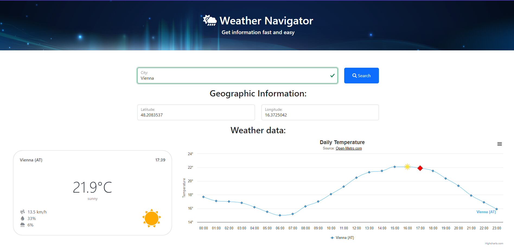
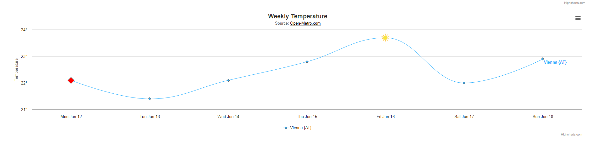

# WeatherNavigator

## Description
This project was created to learn more about APIs and retrieving data from a server. The aim of this website is to display weather data for a specified city. The data includes current temperature, precipitation, and humidity. There are also two HighCharts diagrams: one showing the temperature throughout the day, and another showing the temperature throughout the week.

## Used APIs
To obtain the latitude and longitude of a city, which are required for the Open-Meteo API, we use the OpenWeather API. The OpenWeather API requires an account on their website to obtain an API key for accessing the JSON data. On the other hand, the Open-Meteo API is free and does not require an API key. It provides various parameters for retrieving specific weather data by appending them to the URL.

## Installation
To install the project, simply clone the Git repository. All the necessary files are included in the repository, and relative paths are used, so there should be no issues with loading the files.

## Project Strucutre
The project consists of an HTML file that includes our Bootstrap structure. The logic of the website is implemented in separate functions in the script.js file.

## Visuals

## Authors
@5917010406 Kotoric Mensur 
@5848170106 Zidej Dominik

